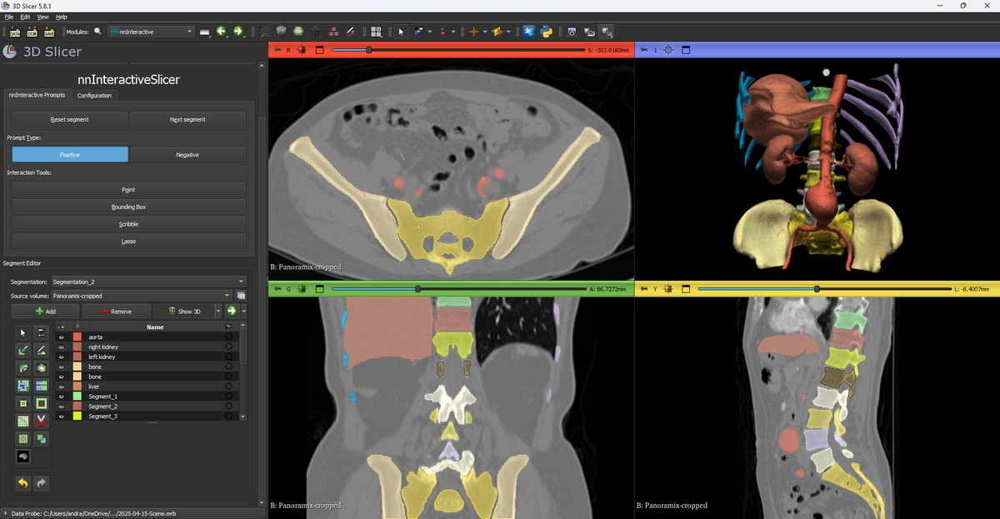
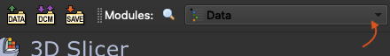
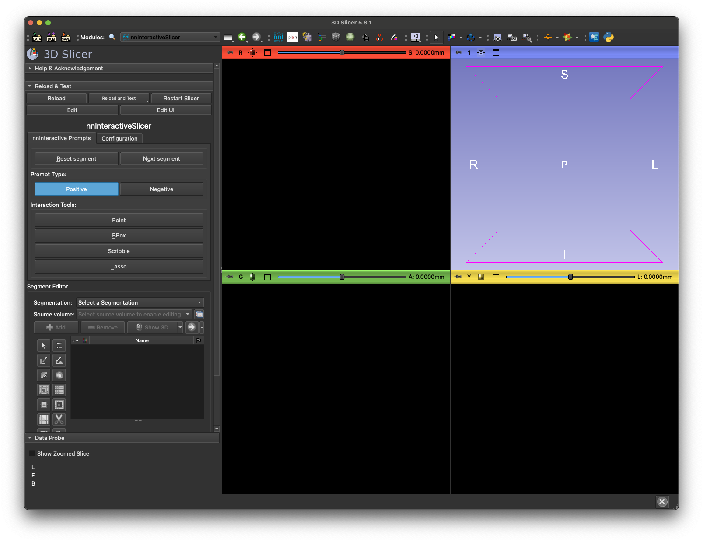

# `SlicerNNInteractive`: nnInteractive meets 3D Slicer

This repository makes [nnInteractive](https://github.com/MIC-DKFZ/nnInteractive) available in [3D Slicer](https://www.slicer.org/). nnInteractive is a deep learning-based framework for interactive segmentation of 3D images, allowing for fast voxel-wise segmentation using prompts like points, scribbles, bounding boxes, and lasso. You can read more about nnInteractive in the [ArXiv paper](https://arxiv.org/abs/2503.08373), or in the original [GitHub repository](https://github.com/MIC-DKFZ/nnInteractive). 3D slicer is a free and open source medical image viewer, and can be downloaded [here](https://download.slicer.org/).

[](https://arxiv.org/abs/2504.07991)



## Video tutorial

https://github.com/user-attachments/assets/c9f9ee0a-f74d-4907-aa21-484dcfd10948

## Table of contents

- [Installation](#installation)
  - [Server side](#server-side)
  - [Client side: Installation in 3D Slicer](#client-side-installation-in-3d-slicer)
- [Usage](#usage)
  - [Editing an existing segment
](#editing-an-existing-segment)
  - [Keyboard shortcuts](#keyboard-shortcuts)
- [Common issues](#common-issues)
- [Contributing](#contributing)
- [Citation](#citation)
- [License](#license)

## Installation

`SlicerNNInteractive` needs to be set up on the server side and the client side. The server side needs relatively heavy compute, as described here:

> You need a Linux or Windows computer with a Nvidia GPU. 10GB of VRAM is recommended. Small objects should work with <6GB. nnInteractive supports Python 3.10+
>
> — [The nnInteractive README](https://github.com/MIC-DKFZ/nnInteractive?tab=readme-ov-file#prerequisites)

The client machine _can_ be the same as the server machine.

### Server side

#### Server running on Linux

You can install the server side of `SlicerNNInteractive` in two different ways:

##### Option 1: Using Docker

```
docker pull coendevente/nninteractive-slicer-server:latest
docker run --gpus all --rm -it -p 1527:1527 coendevente/nninteractive-slicer-server:latest
```

This will make the server available under port `1527` on your machine. If you would like to use a different port, say `1627`, replace `-p 1527:1527` with `-p 1627:1527`.

##### Option 2: Using `pip`

```
pip install nninteractive-slicer-server
nninteractive-slicer-server --host 0.0.0.0 --port 1527
```

If you would like to use a different port, say `1627`, replace `--port 1527` with `--port 1627`.

> [!NOTE]  
> When starting the server, you can ignore the message `nnUNet_raw is not defined [...] how to set this up.`. Setting up these environment variables is not necessary when using `SlicerNNInteractive`.

#### Server running on Windows

##### One-time setup

Python and a pytorch package with GPU support is required. You can follow the steps below to set these up on your computer for your user:

1. Download pixi package manager by running this command in `Terminal` (to launch terminal, press the Windows button on your keyboard, type `terminal` and hit `Enter` key):

```
powershell -ExecutionPolicy ByPass -c "irm -useb https://pixi.sh/install.ps1 | iex"
```

2. Close the terminal and open a new Terminal to run the commands below to install Python and pytorch. The last step may take 10 minutes to complete, with no updates on the output for several minutes.

```
cd /d %localappdata%
mkdir nninteractive-server
cd nninteractive-server
pixi init .
pixi add python=3.12 pip
cd .pixi\envs\default\Scripts
pip3 install torch torchvision torchaudio --index-url https://download.pytorch.org/whl/cu118
```

##### Start the server

To start the server, there is no need to redo the steps above (install pixi and Python), just open `Terminal` and run these commands:

```
cd /d %localappdata%\nninteractive-server\.pixi\envs\default\Scripts
pip install nninteractive-slicer-server
nninteractive-slicer-server --host 0.0.0.0 --port 1527
```

If the firewall asks permission to access the port then allow it.

If you would like to use a different port, say `1627`, replace `--port 1527` with `--port 1627`.

> [!NOTE]  
> When starting the server, you can ignore the message `nnUNet_raw is not defined [...] how to set this up.`. Setting up these environment variables is not necessary when using `SlicerNNInteractive`.

### Client side: Installation in 3D Slicer

1. [Download and install latest version of **3D Slicer**](https://slicer.readthedocs.io/en/latest/user_guide/getting_started.html#installing-3d-slicer)
2. [Install **NNInteractive** extension](https://slicer.readthedocs.io/en/latest/user_guide/extensions_manager.html#install-extensions)
3. Go to the `nnInteractive` module in Slicer and in the `Configuration` tab type in the URL of the server you set up in the [server side](#server-side) installation procedure. This should look something like `http://remote_host_name:1527` or, if you run the server locally, `http://localhost:1527`. If running the server on the same Windows computer as 3D Slicer, you must use `localhost` (ignore that the server suggests that `0.0.0.0` may be used).

## Usage

Once you have completed the installation above, you can use `SlicerNNInteractive` as follows:

1. If you haven't done so already, load in your image (e.g., through dragging your image file into Slicer).

2. Click one of the Interaction Tool buttons from the Interactive Prompts tab (point, bounding box, scribble, or lasso) and place your prompt in the image. This should result in a segmentation.

3. Click `Show 3D` button in the segment editor section (below the prompts section) to see the segmentation results in 3D.

4. If needed, you can correct the generated segmentation with positive and negative prompts (between which you can toggle using the Positive/Negative buttons).

	a) Alternatively, you can reset the current segment using the "Reset segment button".

5. You can add a new segment by clicking the "Next segment" button, or clicking the "+ Add" button in the Segment Editor. You can always go back to previous segments by selecting it in the Segment Editor.

### Editing an existing segment
You can edit an existing segmentation (generated using this plugin, or obtained otherwise, such as through loading in a segmentation file), by selecting the segment in the Segment Editor. Prompts are always applied to the selected segment.

### Keyboard shortcuts
Each button in the Interactive Prompts tab has a keyboard shortcut, indicated by the underlined letter.

## Common issues

- When resetting the server, the Slicer extension sometimes fails silently. Reloading the plugin or restating Slicer often helps.

## Contributing
Read more on how to contribute to this repository [here](CONTRIBUTING.md), while taking into account the [code of conduct](CODE_OF_CONDUCT.md).

## Development

For development, `SlicerNNInteractive` can be installed directly from github, without the Extensions Manager of 3D Slicer.

1. `git clone git@github.com:coendevente/SlicerNNInteractive.git` (or download the current project as a `.zip` file from GitHub).
2. Open 3D Slicer and click the Module dropdown menu in the top left of the 3D Slicer window:
	
3. Go to `Developer Tools` > `Extension Wizard`.
4. Click `Select Extension`.
5. Locate the `SlicerNNInteractive` folder you obtained in Step 1, and select the `slicer_plugin` folder.
6. Go to the Module dropdown menu again and go to `Segmentation` > `SlicerNNInteractive`. This should result in the following view:
  
	a) If you would like to have `SlicerNNInteractive` available in the top menu (as in the image above), go to `Edit` > `Application Settings` > `Modules` and drag `SlicerNNInteractive` from the `Modules:` list to the `Favorite Modules:` list.

## Citation

When using `SlicerNNInteractive`, please cite:

1. The original `nnInteractive` paper:

	> Isensee, F.\*, Rokuss, M.\*, Krämer, L.\*, Dinkelacker, S., Ravindran, A., Stritzke, F., Hamm, B., Wald, T., Langenberg, M., Ulrich, C., Deissler, J., Floca, R., & Maier-Hein, K. (2025). nnInteractive: Redefining 3D Promptable Segmentation. https://arxiv.org/abs/2503.08373 \
	> *: equal contribution

	[](https://arxiv.org/abs/2503.08373)

2. The `SlicerNNInteractive` paper:
	> de Vente, C., Venkadesh, K.V., van Ginneken, B., Sánchez, C.I. (2025). nnInteractiveSlicer: A 3D Slicer extension for nnInteractive. https://arxiv.org/abs/2504.07991

	[](https://arxiv.org/abs/2504.07991)

## License
This repository is available under a Apache-2.0 license (see [here](LICENSE)). 

> [!IMPORTANT]  
> The weights that are being downloaded when running the `SlicerNNInteractive` server are available under a `Creative Commons Attribution Non Commercial Share Alike 4.0` license, as described in the original nnInteractive respository [here](https://github.com/MIC-DKFZ/nnInteractive/tree/master?tab=readme-ov-file#license).
